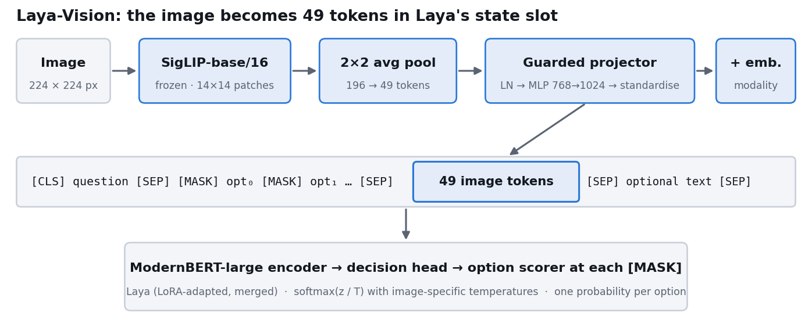
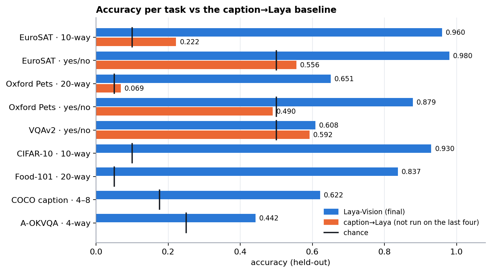
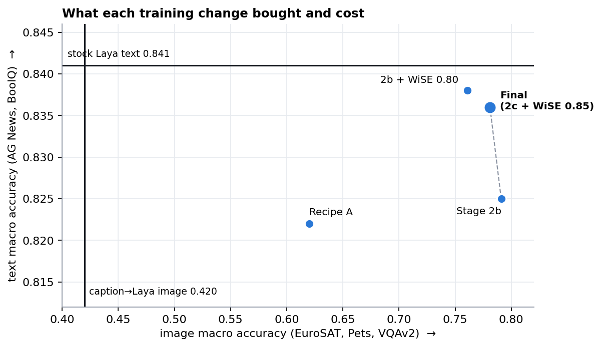
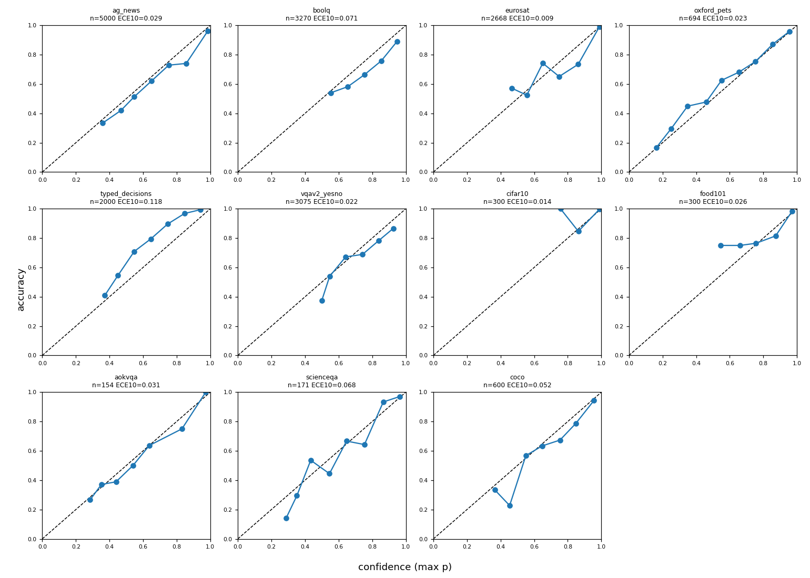
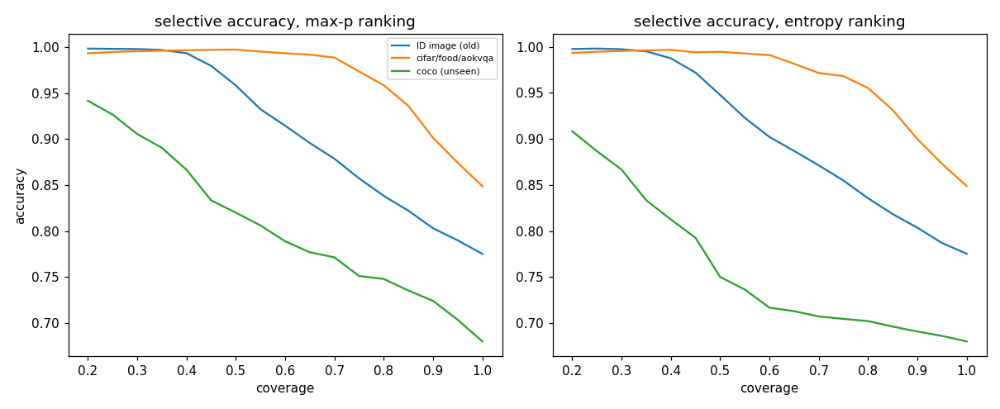
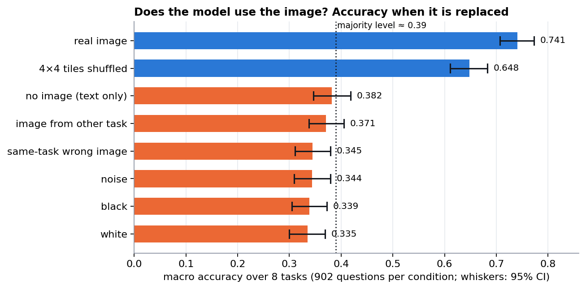
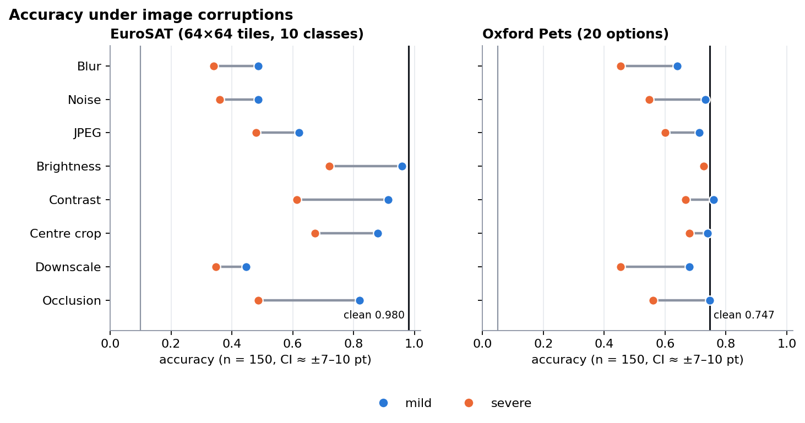
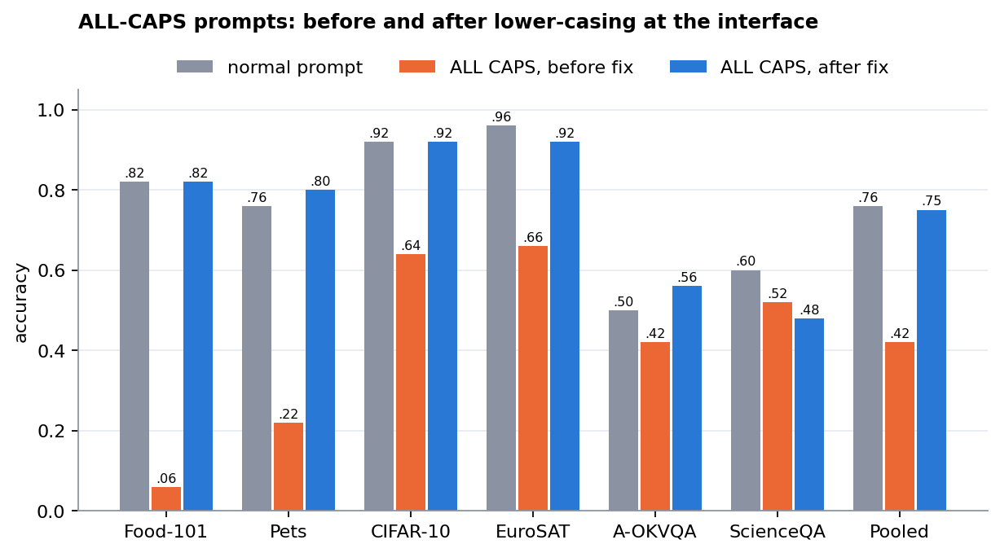
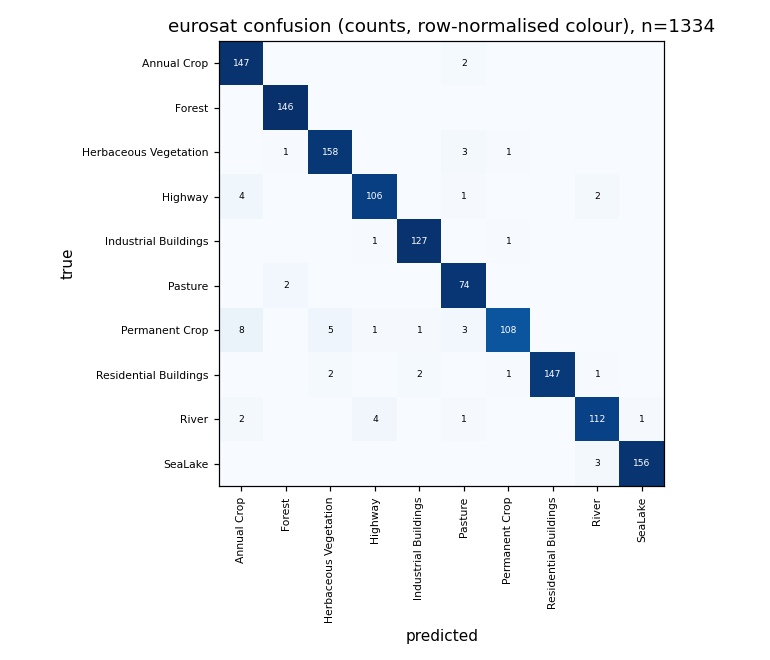
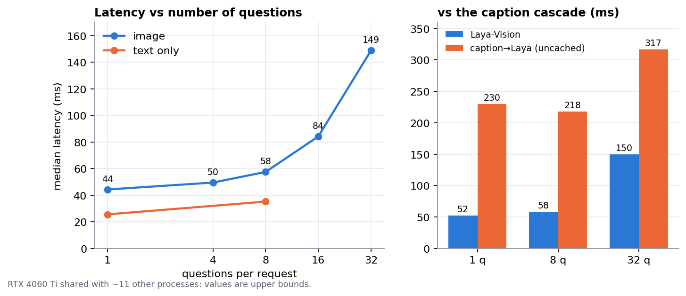

# Laya-Vision: a 0.5B non-autoregressive visual decision model

**Laya-Vision** extends [Laya](https://github.com/NandhaKishorM/laya), a 421M-parameter encoder-only decision model, so that it accepts an **image** (optionally with text) as its state. It answers typed questions (`choice`, `noul`, `score`) with calibrated probabilities in a single forward pass. A SigLIP vision tower and a small projector turn the image into 49 pseudo-tokens that are written into Laya's state slot. Everything downstream (encoder, decision head, option scorer, temperatures, output schema) is Laya's.

This document describes the model and how it was built and trained. It then reports a 12-part evaluation campaign on the final checkpoint `runs/stage2_c/wise085_calibrated`. It ends with conclusions and directions for further work. Every number below comes from a report in `test_campaign/<class>/report.md` (with `results.json` and scripts alongside), `TRAINING.md`, or `eval/results/`. Sample sizes and 95% confidence intervals are given wherever they exist.

**Headline results (final checkpoint):**

| | Result |
|---|---|
| Image recognition (held-out) | EuroSAT 0.960 (10-way), CIFAR-10 0.930 (10-way), Food-101 0.837 (20-way), Oxford Pets 0.651 (20-way) |
| vs. caption→Laya baseline | +0.36 image macro accuracy [0.344, 0.379]; +0.58 on Pets, +0.74 on EuroSAT |
| Weak spots | VQAv2 yes/no 0.608 (caption→Laya 0.592, difference within noise), A-OKVQA 0.44 |
| Calibration | in-distribution image ECE@10 = 0.014; 0.052 on unseen COCO |
| Uses the image | removing or replacing the image costs 0.40 macro accuracy [0.35, 0.45] |
| Text retention vs stock Laya | AG News +1.3 pt, BoolQ −0.5 pt (both within noise) |
| Latency (RTX 4060 Ti, shared) | 44 ms for image + 1 question; about 110 images/s batched; 3.1 GB peak VRAM |

---

## Contents

1. [The model](#1-the-model)
2. [Training](#2-training)
3. [Evaluation methodology](#3-evaluation-methodology)
4. [Results](#4-results)
5. [Conclusions: what we learned](#5-conclusions-what-we-learned)
6. [Improvements and further research](#6-improvements-and-further-research)
7. [Using and reproducing](#7-using-and-reproducing)

---

## 1. The model

### 1.1 Starting point: Laya

Laya (Convai Innovations, Apache 2.0) is a non-autoregressive "System One" decision model. A request is a state (text, a JSON dict or a conversation) plus one or more typed questions. Each question is encoded as its own row:

```
[CLS] <type> question: <instructions> [SEP] [MASK] opt0 [MASK] opt1 … [SEP] <state> [SEP]
```

- **Encoder:** ModernBERT-large (28 layers, d=1024, 16 heads, global attention every 3rd layer, local window 128, RoPE).
- **Decision head:** a question-type embedding, 2 transformer layers, and an option-scorer MLP that reads the hidden state at each `[MASK]`. It produces one logit per option, then softmax(z / T) with temperatures fitted per question type and option count.
- **Act/escalate head:** reads `[CLS]` plus distribution statistics.
- **Training:** RLCD (reinforcement learning with calibrated decisions).
- **Context:** 512 tokens on the English checkpoint, of which 192 hold the question and options and about 320 the state.
- **Question types:**
  - `choice`: pick one of K labelled options.
  - `noul`: a yes/no probability.
  - `score`: an ordinal level.

### 1.2 Architecture

The image is encoded into patch features, pooled, projected into Laya's 1024-d embedding space, and written over placeholder tokens at the start of the state region. The question and options are never truncated, and optional text follows the image block.

```
image ─► SigLIP-base/16 @224 (frozen) ─► 14×14×768 patch grid (second-to-last layer)
              │
              ▼ 2×2 average pool ─► 7×7 = 49 tokens × 768
              ▼ LayerNorm ─► Linear 768→1024 ─► GELU ─► Linear 1024→1024
              ▼ RunningStandardize (subtract running mean, divide by running std, scale to norm≈2)
              ▼ + image-modality embedding (frozen at 0 in recipe B)
              │   49 × 1024 "image tokens"
              ▼
[CLS] <t> question: … [SEP] [MASK] o0 … [MASK] oK [SEP] [IMG]×49 [SEP] optional text … [SEP]
              │  (written into inputs_embeds *before* ModernBERT's embedding LayerNorm,
              │   so image and text positions share the same normalisation)
              ▼
ModernBERT-large encoder (LoRA-adapted, merged) ─► type embedding ─► 2-layer decision head
              ▼
option scorer at each [MASK] ─► softmax(z / T_image) ─► Laya/Jev output schema
```



| Component | Implementation (final checkpoint) | Parameters |
|---|---|---|
| Vision tower | `google/siglip-base-patch16-224` @ `7fd15f06`, frozen; features from layer −2 | 92.9 M |
| Pooler | 2×2 average pool, 196 → 49 tokens, row-major | 0 |
| Projector | LN → Linear 768→1024 → GELU → Linear 1024→1024 → RunningStandardize | 1.8 M |
| Modality embedding | one 1024-d vector added to every image token (frozen) | 1 K |
| Laya | `convaiinnovations/laya` @ `55cf4c4` (laya 0.3.21): ModernBERT-large encoder 394.8 M plus decision head; LoRA r=16 merged into the weights | 421.3 M |
| **Total** | stored in fp32 (1.97 GB) | **516.0 M** |

Implementation details that turned out to matter:

- **The guarded projector (`proj_in_norm`, `proj_standardize`).** ModernBERT applies a LayerNorm to every input embedding, which makes the projector's output scale irrelevant. In the first recipe, the projector learned to push every image onto one shared direction: the cosine similarity between different images' tokens was **0.9995** after the LayerNorm. `RunningStandardize` subtracts the running mean over images, which removes the shared component, and fixes the size of what remains. The image-specific signal can then no longer be trained away (§2.2).
- **One vision forward per distinct image.** The vision tower, pooler and projector run once per image (keyed by sha256). The resulting 49×1024 block is shared by every question row about that image, so extra questions cost only encoder passes.
- **Two temperature sets.** Image rows use `vision.temperature` (choice 1.278, score 1.251, noul 1.361) and per-option-count buckets (choice 3–5: 1.307, 6–10: 1.188, 11+: 1.337). Text rows use the refitted text temperatures.
- **Text parity.** A request without an image takes stock `laya.Agent` code end to end. Loading the final checkpoint with `laya.Agent` and with `laya_vision.load` gives bit-identical text outputs (max |Δp| = 0.0 on 1,200 items, §4.9).
- **Token budget.** 512 tokens in total: up to 192 for question and options, 49 image tokens, 1 `[SEP]`, and about 270 left for optional text.

### 1.3 Interface

```python
import laya_vision
agent = laya_vision.load("runs/stage2_c/wise085_calibrated", device="cuda")
agent.predict(
    {"image": "cat.jpg", "text": "optional caption / OCR / metadata"},
    {"animal":  {"type": "choice", "instructions": "Which animal is shown?",
                 "criteria": {"cat": "a cat", "dog": "a dog", "other": None}},
     "outdoor": {"type": "noul",   "instructions": "Is the photo taken outdoors?"},
     "sharp":   {"type": "score",  "instructions": "How sharp is the photo?",
                 "criteria": ["blurry", "acceptable", "sharp"]}})
```

- **Image formats:** a path, bytes, base64 string, data URL, `PIL.Image` or ndarray.
- **Limits:** 10 MB encoded, 40 MP, JPEG/PNG/WebP/GIF/BMP, at least 1×1 pixel.
- **HTTP server:** `python -m laya_vision.serve` serves the Jev-compatible `POST /v1/systemone` endpoint. `python -m laya_vision.ui` serves the same endpoint plus a local web UI.
- **Input handling added after the campaign** (§4.12):
  - Unpaired UTF-16 surrogates anywhere in the request give a `ValueError` (HTTP 422).
  - Zero-size images are rejected.
  - All-caps text is lower-cased before tokenizing, on image requests only. A string is rewritten only if it has no lowercase letters and a word of at least 4 letters, and answers keep the caller's labels.

---

## 2. Training

All training ran on **one RTX 4060 Ti (8 GB)**. That memory limit is why every stage of the final recipe uses LoRA (r=16, α=32, dropout 0.05, on `Wqkv`, `Wo`, `Wi`; merged before every save) rather than full fine-tuning.

### 2.1 Objective and data

**Objective.** RLCD, as in Laya's fine-tuning notebook:
- G=4 Gaussian noise samples on the logits, with σ falling linearly from 0.4 to 0.1.
- Reward = log score + 0.75·spherical score − 1.0·RPS.
- Group-centred, std-normalised advantage, plus soft cross-entropy with weight 1.0.
- AdamW, cosine schedule, gradient clip 1.0, bf16 autocast, gradient checkpointing.

Every image dataset was converted into typed questions. Augmentation shuffles option order, renames labels, paraphrases the instructions and adds distractors.

| Dataset | Question types | Train rows | Calib rows | Test rows | Used in |
|---|---|---|---|---|---|
| COCO captions (easy negatives) | `choice` (true caption among 4–8), `noul` | 444,316 | 4,220 | 4,612 | stage 1 |
| CIFAR-10 | `choice` 10-way, `noul` class check | 55,834 | 1,122 | 3,044 | stage 2 |
| Food-101 | `choice` up to 20-way, `noul` | 55,896 | 1,234 | 2,870 | stage 2 |
| Oxford-IIIT Pets | `choice` 20 of 37 breeds, `noul` | 13,696 | 308 | 694 | stage 2 |
| EuroSAT | `choice` 10-way, `noul` | 50,174 | 1,158 | 2,668 | stage 2 |
| A-OKVQA | `choice` 4-way MCQ | 16,902 | 365 | 934 | stage 2 |
| ScienceQA (image subset) | `choice` MCQ | 9,640 | 165 | 527 | stage 2 |
| VQAv2 yes/no | `noul` | 55,668 + 160,000 (train split) | 1,257 | 3,075 | stage 2 / 2c |
| Laya typed decisions (text) | all types | 5,765 | 235 | 2,000 | text replay |
| AG News, BoolQ (text) | `choice`, `noul` | — | — | 5,000 / 3,270 | text retention test only |

KonIQ-10k (image quality `score`) was planned but never downloaded, so **no image `score` data was used in training** (see §4.8).

### 2.2 Recipe A: a failure

Recipe A followed the original design:
- **Stage 1:** projector only, LR 1e-3, Laya frozen.
- **Stage 2:** fine-tune encoder, head and projector on 75% image and 25% text rows.

**It collapsed.** After stage 1 every image looked alike to Laya (image-token cosine 0.9995). Its COCO caption-matching accuracy of 0.37 came from text priors: with a *wrong* image it scored 0.42. Stage 2 then learned recognition partly through the encoder, but its yes/no image questions stayed near chance. VQAv2 reached 0.527, below the caption baseline's 0.592.

This was diagnosed with a metric added to the trainer:

> **image_grounding** = accuracy − accuracy when each row's image is swapped for another image in the batch.

A grounding score near 0, or an image-token cosine near 1, means the model is not using the image. Recipe A's apparent "image accuracy" was text prior.

### 2.3 Recipe B/C: the final recipe

| Stage | Config | Trainable (LR) | Data | Steps / time |
|---|---|---|---|---|
| 1 Align | `stage1_b.yaml` | projector 1e-4, LoRA encoder 5e-5, head 1e-4; modality embedding frozen; guarded projector on | 90% COCO caption questions (easy negatives) + 10% text | 320k rows (5,000 steps × 64), ~4.5 h; best checkpoint chosen by `image.grounding` |
| 2 Decide | `stage2_b.yaml` | projector 1e-4, LoRA encoder 2.5e-5, head 1e-4 | 70% image (7 tasks) + 30% text | 2 epochs, ~14 h; best checkpoint chosen by `image.accuracy` |
| 2c Continue | `stage2_c.yaml` | projector 5e-5, encoder 2e-5, head 5e-5 | as 2b + 160k VQAv2 train-split yes/no | 200k rows (~3,100 steps), ~4 h |
| WiSE-FT | `train.interpolate --alpha 0.85` | — | — | θ = 0.85·θ_2c + 0.15·θ_stock-Laya |
| 3 Calibrate | `calibrate_c.yaml` | temperatures only (LBFGS on log T, clamped to [0.5, 5]) | `*.calib.jsonl` | minutes |

- **WiSE-FT** interpolates the fine-tuned weights back toward stock Laya to undo text regression.
- **How α was chosen:** on held-out data only, never on the test sets. The rule, fixed before evaluation, was: an estimated BoolQ drop of at most 1.5 points on a 3,000-item BoolQ *train*-split proxy, then the best mean image calib accuracy. The proxy overstated the real test drop by about 1.8×.
- **Effect of the guarded projector in stage 1:**
  - grounding rose from 0.005 to 0.337;
  - image-token cosine fell from 0.9995 to 0.05;
  - COCO caption matching went from 0.385 (recipe A) to 0.731.

### 2.4 Acceptance (from `TRAINING.md`, full test sets)

| | Recipe A | **Final (2c, α=0.85)** | caption→Laya | stock Laya | Criterion |
|---|---|---|---|---|---|
| EuroSAT | 0.929 | **0.970** | 0.389 | | beat caption→Laya on ≥ 3 of the image tasks |
| Oxford Pets | 0.403 | **0.765** | 0.280 | | |
| VQAv2 yes/no | 0.527 | **0.608** | 0.592 | | |
| BoolQ | 0.719 | 0.747 | | 0.756 | text within 2 pt of stock |
| AG News | 0.925 | 0.924 | | 0.926 | |
| Image ECE@10 | 0.010 | 0.014 | | | ≤ 0.10 |
| p50 latency vs text-only Laya | 1.69× | 1.68× | | | ≤ 2× |

All criteria pass. KonIQ was missing, so only 3 image tasks are scored, and VQAv2 "beats" the baseline only nominally (+0.016, CI includes 0; §4.1).

---

## 3. Evaluation methodology

The campaign split the evaluation into 12 independent test classes. Each was run by a separate agent under a shared brief (`test_campaign/BRIEF.md`):
- held-out test splits only, fixed seeds;
- n reported for every number;
- 95% CIs, either Wilson for proportions or bootstrap (clustered by image where rows share an image, paired where models or conditions are compared);
- an explicit baseline or chance level for every number;
- "within noise" stated whenever a CI includes zero.

**Baselines:**
- chance (1/K) or the majority class;
- **caption→Laya**: a BLIP-base caption (`Salesforce/blip-image-captioning-base` @ `82a3776`) passed as text to stock Laya;
- SigLIP zero-shot, which applies to caption matching only;
- stock Laya, for the text tasks.

**Conditions.** One 8 GB RTX 4060 Ti, shared by up to 12 concurrent test agents. A machine reboot killed every job midway, and they were resumed from checkpoints. This affects latency numbers (upper bounds) and a few sampling streams (noted per class), but not the accuracy measurements.

**Accuracy definitions.** Accuracy is the argmax match against the gold label. In the full-test tables, Pets and EuroSAT "accuracy" pools the `choice` row and the easier `noul` class-check row for each image. Classes 01 and 11 report the `choice` row alone, which is why Pets appears as both 0.765 (pooled) and 0.651 (20-way choice).

| # | Class | Question | n |
|---|---|---|---|
| 01 | Accuracy | held-out accuracy, Brier, NLL vs chance and caption→Laya | full tests + 300 images/task |
| 02 | Calibration | ECE, selective prediction, shift | 16.7k rows + 150 states/task |
| 03 | Image robustness | 22 corruptions on EuroSAT and Pets | 150 images × 22 conditions × 2 tasks |
| 04 | Prompt invariance | order, labels, paraphrase, case, option count | 300 images × 21 variants |
| 05 | Modality grounding | is the image actually used? | 902 questions × 8 conditions |
| 06 | Generalization | unseen option counts, keys, vocabulary, questions | 2,960 questions |
| 07 | Text retention | does text-only Laya ability survive? | 1,200 items × 5 models |
| 08 | Latency and resources | latency, throughput, VRAM, CPU | 3 rounds × 8 iterations per config |
| 09 | API edge cases | Python API, HTTP, UI robustness | 179 + 74 + 54 + 12 checks |
| 10 | Recipe comparison | what each training change bought | 16,707 paired rows |
| 11 | Error analysis | where and why the model fails | full test predictions |
| 12 | Question types and mixed states | `choice`/`noul`/`score`, image+text conflicts | 50 per probe |

---

## 4. Results

### 4.1 Accuracy on held-out image tasks (class 01)

95% CIs come from a bootstrap over images. Pets, EuroSAT and VQAv2 use the full test sets; rows marked * use a 300-image subsample.

| Task / question type | n | Chance | **Final acc [95% CI]** | Brier | NLL | caption→Laya | Final − caption (paired) |
|---|---|---|---|---|---|---|---|
| Oxford Pets `choice` (20) | 347 | 0.05 | **0.651** [0.605, 0.706] | 0.466 | 1.002 | 0.069 | +0.582 [+0.527, +0.634] |
| Oxford Pets `noul` | 347 | 0.50 | **0.879** [0.841, 0.911] | 0.189 | 0.314 | 0.490 | +0.389 [+0.326, +0.452] |
| EuroSAT `choice` (10) | 1,334 | 0.10 | **0.960** [0.949, 0.970] | 0.062 | 0.127 | 0.222 | +0.738 [+0.714, +0.762] |
| EuroSAT `noul` | 1,334 | 0.50 | **0.980** [0.972, 0.987] | 0.034 | 0.062 | 0.556 | +0.424 [+0.396, +0.451] |
| VQAv2 yes/no `noul` | 3,075 | 0.50 (majority 0.533) | **0.608** [0.591, 0.626] | 0.330 | 0.657 | 0.592 | +0.017 [−0.005, +0.039] |
| CIFAR-10 `choice` (10)* | 300 | 0.10 | **0.930** [0.900, 0.957] | 0.103 | 0.203 | — | |
| CIFAR-10 `noul`* | 300 | 0.50 | **0.990** [0.977, 1.000] | 0.014 | 0.028 | — | |
| Food-101 `choice` (20)* | 300 | 0.05 | **0.837** [0.790, 0.880] | 0.242 | 0.531 | — | |
| Food-101 `noul`* | 300 | 0.50 | **0.937** [0.907, 0.963] | 0.084 | 0.150 | — | |
| A-OKVQA `choice` (4)* | 310 | 0.25 | **0.442** [0.388, 0.495] | 0.671 | 1.231 | — | |
| COCO caption `choice` (4–8)* | 600 | 0.176 | **0.622** [0.583, 0.662] | 0.515 | 0.927 | — | |
| COCO caption `noul`* | 600 | 0.50 | **0.745** [0.713, 0.777] | 0.336 | 0.494 | — | |

Accuracy by number of options, pooling `choice` rows across tasks, so option count and task difficulty are confounded:

| K | n | Chance | Acc [95% CI] |
|---|---|---|---|
| 4 (A-OKVQA, COCO) | 431 | 0.25 | 0.492 [0.445, 0.538] |
| 5–8 (COCO) | 120 / 107 / 118 / 134 | 0.20–0.125 | 0.600 / 0.636 / 0.678 / 0.582 |
| 10 (EuroSAT, CIFAR-10) | 1,634 | 0.10 | 0.955 [0.945, 0.964] |
| 20 (Pets, Food-101) | 647 | 0.05 | 0.737 [0.702, 0.771] |



**Findings:**
- On recognition tasks the model is far above both chance and caption→Laya, by +0.39 to +0.74, with paired CIs well clear of zero. Generic BLIP captions carry no breed or land-use information, so the caption baseline sits near chance on Pets and EuroSAT.
- **VQAv2 yes/no is the one task without a demonstrated gain:** 0.608 against the caption baseline's 0.592, with a paired CI of [−0.005, +0.039]. Its better Brier score (0.330 vs 0.497) comes from less extreme probabilities, not from better answers.
- Task type, not option count, drives accuracy. Within COCO, accuracy shows no trend from K=4 to K=8.
- Saved predictions reproduce exactly on a fresh run (60 Pets images, max |Δp| = 0.0).

### 4.2 What each training change bought (class 10)

These are paired comparisons on the identical 16,707 held-out rows (cluster bootstrap, 2,000 resamples). Text macro averages AG News and BoolQ.

| Model | EuroSAT | Pets | VQAv2 y/n | **Image macro** | AG News | BoolQ | **Text macro** | Typed decisions |
|---|---|---|---|---|---|---|---|---|
| caption→Laya | 0.389 | 0.280 | 0.592 | 0.420 [0.406, 0.434] | | | | 0.361 |
| stock Laya (text only) | | | | | 0.926 | 0.756 | 0.841 [0.833, 0.849] | 0.360 |
| stage2_a (recipe A) | 0.929 | 0.403 | 0.527 | 0.620 [0.609, 0.631] | 0.925 | 0.719 | 0.822 [0.813, 0.831] | 0.745 |
| stage2_b | 0.970 | 0.810 | 0.592 | **0.791** [0.779, 0.803] | 0.924 | 0.726 | 0.825 [0.816, 0.834] | 0.744 |
| stage2_b + WiSE 0.80 | 0.967 | 0.725 | 0.591 | 0.761 [0.747, 0.774] | 0.926 | 0.750 | 0.838 [0.830, 0.847] | 0.705 |
| **stage2_c + WiSE 0.85 (final)** | 0.970 | 0.765 | 0.608 | 0.781 [0.769, 0.793] | 0.924 | 0.747 | **0.836** [0.827, 0.844] | 0.715 |

On stage-1 COCO caption matching (`choice` rows, n=750), **SigLIP zero-shot scores 0.823** [0.793, 0.853], stage1_b 0.731 [0.695, 0.764] and stage1_a 0.385 [0.352, 0.420].

Key paired differences (macro, 95% CI):

| Comparison | Δ |
|---|---|
| Image: recipe B − recipe A | **+0.171** [0.155, 0.187] |
| Image: final − caption→Laya | **+0.361** [0.344, 0.379] |
| Image: stage2_b − final | +0.009 [−0.001, 0.021] (within noise) |
| Image: stage2_b − WiSE 0.80 | +0.030 [0.018, 0.042] |
| Text: stock − stage2_a | +0.019 [0.012, 0.027] |
| Text: stock − stage2_b | +0.016 [0.008, 0.023] |
| Text: stock − WiSE 0.80 | +0.003 [−0.003, 0.009] |
| Text: stock − final | +0.006 [−0.001, 0.012] (within noise) |
| Typed decisions: final − stage2_b | −0.029 [−0.046, −0.012] |
| Stage 1: SigLIP zero-shot − stage1_b | +0.092 [0.056, 0.131] |
| Stage 1: stage1_b − stage1_a | +0.345 [0.297, 0.391] |



**Findings:**
1. **The guarded projector with LoRA from stage 1 (recipe B) produced essentially all of the image gain** (+0.17 macro). The grounding metric did not change accuracy itself, but it exposed recipe A as relying on text priors.
2. **WiSE-FT trades image accuracy for text accuracy almost linearly.** The cost falls mostly on Pets. In the α sweep on calib splits, Pets fell from 0.851 to 0.805 between α=1.0 and α=0.85 while the BoolQ proxy rose from 0.784 to 0.812.
3. **The final checkpoint is the only one** whose text gap to stock includes zero while its image macro stays within about 1 point of the best model.
4. The VQAv2 continuation moved VQAv2 by only +0.016. VQA-style reasoning remains the unsolved part.
5. **Limitation:** recipe B bundles several changes (guarded projector, lower projector LR, LoRA, easier negatives, text rows in stage 1). There are no ablations to separate them.

### 4.3 Calibration (class 02)

Confidence is the max probability. The table gives ECE with 10 equal-width bins, adaptive (equal-mass) ECE, and how well confidence ranks errors (AUROC, using max-p or entropy as the score).

| Task | n | Acc [CI] | ECE10 | ECE15 | aECE10 | AUROC (max-p) | AUROC (entropy) | Selective acc @ 80/50/20% coverage |
|---|---|---|---|---|---|---|---|---|
| Oxford Pets | 694 | 0.765 [0.73, 0.80] | 0.023 | 0.035 | 0.043 | 0.81 | 0.71 | 0.85 / 0.93 / 0.99 |
| VQAv2 yes/no | 3,075 | 0.608 [0.59, 0.63] | 0.022 | 0.023 | 0.037 | 0.59 | 0.59 | 0.63 / 0.68 / 0.72 |
| EuroSAT | 2,668 | 0.970 [0.96, 0.98] | 0.009 | 0.012 | 0.010 | 0.94 | 0.92 | 1.0 / 1.0 / 1.0 |
| CIFAR-10 | 300 | 0.980 [0.96, 0.99] | 0.014 | 0.019 | 0.017 | 0.86 | 0.82 | 1.0 / 0.99 / 1.0 |
| Food-101 | 300 | 0.927 [0.89, 0.95] | 0.026 | 0.029 | 0.029 | 0.89 | 0.82 | 0.98 / 1.0 / 1.0 |
| A-OKVQA | 154 | 0.442 [0.37, 0.52] | 0.031 | 0.078 | 0.069 | 0.63 | 0.62 | 0.46 / 0.53 / 0.71 |
| ScienceQA | 171 | 0.620 [0.55, 0.69] | 0.068 | 0.085 | 0.089 | 0.78 | 0.78 | 0.69 / 0.81 / 0.97 |
| **COCO (unseen in stage 2)** | 600 | 0.680 [0.64, 0.72] | **0.052** | 0.046 | 0.050 | **0.74** | 0.64 | 0.75 / 0.82 / 0.94 |
| AG News (text) | 5,000 | 0.924 | 0.029 | 0.030 | 0.029 | 0.86 | 0.85 | 0.97 / 0.99 / 1.0 |
| BoolQ (text) | 3,270 | 0.747 | 0.071 | 0.072 | 0.071 | 0.70 | 0.70 | 0.80 / 0.85 / 0.92 |
| Typed decisions (text) | 2,000 | 0.715 | **0.118** | 0.118 | 0.118 | 0.75 | 0.68 | 0.78 / 0.87 / 0.97 |





Group ECE10:
- in-distribution image tasks (n=6,437): 0.014 [0.010, 0.025], AUROC 0.815;
- COCO: 0.052 [0.04, 0.09], AUROC 0.738;
- text overall: 0.042 [0.036, 0.049].

Fitting a separate oracle temperature for each task on its test rows (optimistic by construction) shows where miscalibration is systematic:

| Task | Oracle T | ECE before → after | Direction |
|---|---|---|---|
| Typed decisions | 0.52 | 0.118 → 0.014 | underconfident |
| BoolQ | 1.48 | 0.071 → 0.009 | overconfident |
| AG News | 1.23 | | |
| COCO | 1.16 | 0.052 → 0.038 | |
| A-OKVQA | 1.22 | 0.031 → 0.040 | noise-level |

The main image tasks already have an oracle T of 0.9–1.15, so their temperatures are about right.

**Findings:**
- In-distribution image calibration is good: ECE10 is 0.009–0.026, well under the 0.10 acceptance bar.
- Calibration degrades gracefully, not catastrophically, under shift. On unseen COCO, ECE roughly triples to 0.052 and error ranking drops (AUROC 0.74 vs 0.82–0.93).
- Text calibration is the weaker part: typed decisions is underconfident (0.118) and BoolQ overconfident (0.071).
- **Max-p is never worse than entropy as a confidence score.** Selective prediction works well: at 50% coverage, in-distribution image accuracy rises from 0.775 to 0.96, and COCO from 0.68 to 0.82.
- **Selective prediction is weak where the model is near chance:** VQAv2 has an AUROC of 0.59.
- Mid-size option counts (K=3–8) are overconfident (ECE 0.13–0.16), but those cells are small (n=54–71) and dominated by COCO and ScienceQA.

### 4.4 Does the model use the image? (class 05)

Each question was re-asked with the real image replaced by an uninformative or mismatched one:
- **black / white / noise:** a blank image of the same size;
- **patch4x4:** the image cut into 4×4 tiles and shuffled (keeps colour and texture, destroys layout);
- **shuf-within:** another image from the same task with a different label;
- **swap-task:** an image from a different task;
- **text-only:** no image at all.

The sample is partial (the run hit its time budget): 45 images per task, **902 questions × 8 conditions = 7,216 predictions**.

| Task (n questions) | real | black | white | noise | patch4x4 | shuf-within | swap-task | text-only | majority |
|---|---|---|---|---|---|---|---|---|---|
| CIFAR-10 (90) | .956 | .311 | .311 | .256 | .500 | .244 | .278 | .300 | .356 |
| EuroSAT (90) | .922 | .344 | .344 | .367 | .833 | .322 | .356 | .356 | .389 |
| Food-101 (90) | .889 | .278 | .267 | .278 | .789 | .289 | .278 | .289 | .311 |
| Oxford Pets (90) | .700 | .244 | .244 | .244 | .644 | .289 | .256 | .222 | .356 |
| COCO (135) | .622 | .274 | .274 | .304 | .593 | .311 | .370 | .444 | .400 |
| A-OKVQA (48) | .521 | .208 | .229 | .208 | .521 | .292 | .354 | .396 | .333 |
| ScienceQA (56) | .661 | .571 | .571 | .589 | .714 | .589 | .607 | .625 | .482 |
| VQAv2 yes/no (303) | .611 | .492 | .465 | .502 | .568 | .465 | .459 | .475 | .525 |
| **Macro** | **.741** [.707, .773] | .339 | .335 | .344 | .648 | .345 | .371 | .382 | ~.39 |
| Drop vs real [CI] | | −.40 [.36, .45] | −.41 | −.40 | **−.09** [.06, .13] | −.40 | −.37 | −.36 [.31, .40] | |



Per-task detail: [`test_campaign/05_modality_grounding/grounding.png`](test_campaign/05_modality_grounding/grounding.png).

**Findings:**
- **The image is used strongly.** Removing or mismatching it costs about 0.40 macro accuracy. On the classification tasks the `choice` questions fall from 0.53–0.93 to 0.02–0.13, *below* chance, because the model answers from the (wrong) image rather than from a prior. A wrong-but-real image does no better than a black one, so the model reads image content, not just whether an image is present.
- **Much of the signal is global colour and texture.** Shuffling 4×4 tiles costs only 0.09 macro, and almost nothing on EuroSAT, Food-101, COCO and A-OKVQA. CIFAR-10 is the exception (0.96 → 0.50): its objects are small and low-resolution, so layout matters.
- **Grounding is weak on ScienceQA and VQAv2.** ScienceQA scores 0.66 with the image against 0.57–0.63 without it. VQAv2 scores 0.61 against 0.46–0.50; with any uninformative image it predicts "yes" only 7–12% of the time, and never without an image, so it collapses to the always-"no" level.
- **Confidence barely reacts to a useless image.** Macro confidence is 0.76 with the real image and 0.71 with a black one (0.59 with no image), so confidence cannot flag a missing or irrelevant image. On blank images the model falls back to fixed defaults (CIFAR-10 → the last class, VQAv2 → "no").

### 4.5 Robustness to image corruptions (class 03)

EuroSAT (64×64 satellite tiles, 10 classes) and Oxford Pets (photos, 20 options) were tested on 150 fixed images each under 22 conditions. CIs are Wilson, about ±7–10 pt. Mean confidence is in brackets. Clean accuracy: **EuroSAT 0.980** [0.94, 0.99] [conf 0.98], **Pets 0.747** [0.67, 0.81] [conf 0.73].

| Corruption | EuroSAT mild | EuroSAT severe | Pets mild | Pets severe |
|---|---|---|---|---|
| Gaussian blur (r = 2 / 6) | 0.487 [0.91] | 0.340 [0.98] | 0.640 [0.71] | 0.453 [0.66] |
| Gaussian noise (σ = 20 / 70) | 0.487 [0.92] | 0.360 [0.96] | 0.733 [0.73] | 0.547 [0.66] |
| JPEG (q = 30 / 5) | 0.620 [0.84] | 0.480 [0.85] | 0.713 [0.72] | 0.600 [0.69] |
| Brightness (×0.6 / ×0.25) | 0.960 [0.96] | 0.720 [0.90] | 0.727 [0.72] | 0.727 [0.73] |
| Contrast (×0.5 / ×0.2) | 0.913 [0.95] | 0.613 [0.90] | 0.760 [0.72] | 0.667 [0.71] |
| Centre crop (70% / 40%) | 0.880 [0.95] | 0.673 [0.89] | 0.740 [0.73] | 0.680 [0.71] |
| Down/up-scale (×4 / ×12) | 0.447 [0.90] | 0.347 [0.97] | 0.680 [0.71] | 0.453 [0.66] |
| Occlusion (15% / 40% area) | 0.820 [0.91] | 0.487 [0.88] | 0.747 [0.71] | 0.560 [0.64] |

| Geometry / colour | rot90 | rot180 | hflip | vflip | grayscale |
|---|---|---|---|---|---|
| EuroSAT | 0.980 | 0.980 | 0.973 | 0.987 | 0.907 |
| Pets | 0.660 | 0.640 | 0.767 | 0.673 | 0.760 |



**Findings:**
- **Robust:** moderate brightness and contrast changes, mild cropping, horizontal flips, and (on EuroSAT) every rotation and flip.
- **Fragile to anything that destroys high-frequency detail.** Even *mild* blur, noise or a 4× downscale halves EuroSAT accuracy (0.98 → 0.45–0.49); JPEG at quality 30 gives 0.62. Pets photos tolerate the mild versions (within the CIs) but fall to 0.45 under severe blur or downscaling.
- **Confidently wrong under corruption.** On corrupted EuroSAT, confidence stays at 0.84–0.98 while accuracy falls to 0.34–0.62. With blur at r=6, confidence is 0.98 at accuracy 0.34, and predictions collapse toward one class (top-class share 0.37 → 0.53).
- On Pets, rotating by 90° or 180° or flipping vertically costs 8–11 points, and agreement with the clean predictions drops to 0.67–0.74.

### 4.6 Prompt invariance (class 04)

There were 50 images for each of 6 tasks (n=300), each asked in 20–21 prompt variants within one call. The **all-caps fix** (§4.12) was applied before this run, and the table shows post-fix numbers.

| Variant | Acc [95% CI] | Δ vs base | Flip rate |
|---|---|---|---|
| **base** | **0.760** [0.710, 0.807] | | |
| option order (4 shuffles) | 0.733–0.763 | −0.027 to +0.003 (all CIs include 0) | 0.09–0.11 |
| relabel: upper / numbers / "Option X" | 0.760 / 0.730 / 0.730 | 0.000 / −0.030 / −0.030 (CIs touch 0) | 0.04 / 0.08 / 0.11 |
| answer text as the key (letter tasks, n=100) | 0.610 | +0.060 [0.000, 0.130] | 0.16 |
| paraphrase: in-distribution / 3 out-of-distribution | 0.763 / 0.750–0.760 | +0.003 / −0.010 to 0.000 | 0.01–0.04 |
| lowercase | 0.740 | −0.020 [−0.043, 0.003] | 0.057 |
| **ALL CAPS, before fix** | **0.420** [0.363, 0.477] | **−0.340** [−0.403, −0.277] | 0.557 |
| **ALL CAPS, after fix** | **0.750** [0.700, 0.797] | −0.010 [−0.033, 0.017] | 0.077 |
| punctuation stripped | 0.757 | −0.003 | 0.007 |
| verbose option text | 0.687 | **−0.073** [−0.117, −0.030] | 0.19 |
| +4 foreign distractors (letter tasks, n=100) | 0.380 | **−0.170** [−0.250, −0.090] | 0.36 |
| drop half of the distractors | 0.767 | +0.003 | 0.10 |
| K = 2 / 5 / 10 / 20 (chance 0.50 / 0.20 / 0.10 / 0.05) | 0.883 / 0.770 / 0.905 / 0.780 | | |



All-caps accuracy by task, before and after the fix:

| Task | base | ALL CAPS before | ALL CAPS after |
|---|---|---|---|
| Food-101 | 0.82 | **0.06** | 0.82 |
| Oxford Pets | 0.76 | 0.22 | 0.80 |
| CIFAR-10 | 0.92 | 0.64 | 0.92 |
| EuroSAT | 0.96 | 0.66 | 0.92 |
| A-OKVQA | 0.50 | 0.42 | 0.56 |
| ScienceQA | 0.60 | 0.52 | 0.48 |

**Findings:**
- **Surface form barely matters.** Option order, label style, paraphrase, punctuation and lowercase each move accuracy by at most 0.03, within noise.
- **Individual answers still flip.** Option order changes about 10% of answers, rising to 14–22% on ScienceQA, A-OKVQA and Pets, the tasks where the model is already weak. All five orders agree on 81% of images, and a majority vote over orders gives no gain.
- **ALL-CAPS text was catastrophic before the fix.** Food-101 fell from 0.82 to 0.06. The cause is the case-sensitive tokenizer: `"apple pie"` becomes `['apple', 'Ġpie']`, but `"APPLE PIE"` becomes `['APP', 'LE', 'ĠP', 'IE']`, pieces the model rarely saw in training. Lower-casing at the interface restores base accuracy (pooled 0.420 → 0.750) and changes no prediction for any other variant.
- **ScienceQA's remaining all-caps gap is a lowercase effect.** It scores −0.12 under plain lowercase as well, and its fixed all-caps answers match the lowercase answers on all 50 items.
- **What does cost accuracy is option content:** verbose option text (−0.07) and extra unrelated distractors (−0.17).

### 4.7 Generalization beyond the trained formats (class 06)

There were 80 images per cell across 7 held-out sets (2,960 questions). CIs are about ±8–10 pt.

| Variant | Accuracy | Δ vs original |
|---|---|---|
| CIFAR-10 original (10 options) | 0.963 [0.90, 0.99] | |
| CIFAR-10 synonym labels / "a photo of a X" | 0.975 / 0.963 | +0.013 / 0.000 |
| CIFAR-10 letter keys A–J / digit keys | 0.963 / 0.963 | 0.000 (identical predictions) |
| CIFAR-10 animal-vs-vehicle / living-vs-machine (new questions) | 0.988 / 0.912 [0.83, 0.96] | +0.025 / −0.050 (n.s.) |
| Food-101 original (20 options) | 0.850 [0.76, 0.91] | |
| Food-101 **30 options** (more than the 20 seen in training) | 0.875 | +0.025 |
| Food-101 letter MCQ (20) / "homemade X" (8) | 0.850 / 0.900 | 0.000 / +0.050 |
| Oxford Pets original (20) / cat-vs-dog (new question) | 0.650 / 0.988 | |
| A-OKVQA original / shuffled / keys w–z | 0.550 / 0.525 / 0.537 | −0.025 / −0.013 |
| ScienceQA original / keys w–z | 0.512 / 0.550 (chance 0.38) | +0.037 |
| EuroSAT original / synonym descriptions | 0.950 / 0.925 | −0.025 [−0.06, 0.00] |
| COCO (stage 1 only) 4–8 / 10 / 2 options | 0.637 / 0.625 / 0.887 | −0.013 / +0.25 |

**Findings:**
- **Changes of format and key symbol cost nothing.** Letter, digit or w–z keys give identical or within-noise accuracy on every task.
- **Option count extrapolates in both directions,** up to 30 options.
- **New vocabulary costs little.** Synonyms keep CIFAR-10 at 0.975. The weakest case is abstract category words: "living vs machine" scores 0.912, with confidence falling from 0.97 to 0.77.
- **Coarse questions never trained on score 0.91–0.99,** although they are easy reductions of labels the model already knows.
- **The hard reasoning sets are limited by capability, not format.** A-OKVQA (0.55) and ScienceQA (0.51) are unaffected by any perturbation.
- **Not tested:** genuinely new visual domains (no held-out set outside the training label spaces except COCO).

### 4.8 Question types and mixed image+text states (class 12)

n = 50 per probe unless noted (CIs about ±13 pt).

| Probe | Result (95% CI) | Baseline |
|---|---|---|
| A. `choice`: Pets (20) / COCO / A-OKVQA / ScienceQA | 0.74 [.60, .84] / 0.54 [.40, .67] / 0.40 [.28, .54] / 0.60 [.46, .72] | chance .05 / .25 / .25 / .25 |
| B. `noul` matched vs counterfactual label, AUC: Pets / Food-101 / CIFAR-10 (n=100) | 0.954 / 0.986 / 0.998 (acc .88 / .87 / .96) | AUC 0.5 |
| B. `noul` COCO caption true vs swapped | AUC 0.845, acc .65 [.55, .74] | 0.5 |
| B. `noul` VQAv2 yes/no (n=100) | AUC 0.658, acc .64 [.54, .73] | majority .60 |
| C. `score` synthetic blur (12 images × 4 levels) | Spearman +0.58 | should increase with blur |
| C. `score` darkness / low contrast / desaturation | ρ = 0.02 / 0.07 / 0.06 (flat) | |
| C. `score` noise / dot count | ρ = −0.33 / −0.31 (wrong sign) | |
| C. `score` text-only sentiment (4 texts) | 0.04, 0.91, 2.00, 2.58 (monotone) | |
| D. Pets: image only / image + true text | 0.80 [.67, .89] / 1.00 [.93, 1.0] | |
| D. Pets: image + **wrong** text → image label / text label | 0.42 [.29, .56] / **0.48** [.35, .62] | |
| D. Pets: grey image + true text | 1.00 | |
| D. ScienceQA: image + text / image only / text only | 0.48 / 0.56 / 0.58 (within noise) | .25 |
| D. OCR, 8-way rendered word (n=24): image only | 0.33 [.18, .53] | chance .125 |
| D. OCR + agreeing text / + contradicting text | 0.92 / follows the text 0.79 (the image 0.125) | |
| E. 5-question call vs single calls, max \|Δp\| | mean 0.009, max 0.034 | |
| E. reversed question order | Δ = 0.0 exactly | |

**Findings:**
- **`choice` and `noul` work well for class-like content.** Label verification reaches an AUC of 0.95–0.998.
- **VQA-style yes/no is near-useless** (AUC 0.66).
- **Image `score` does not track the property being asked about.** Only blur is mildly ordinal; the others are flat or go the wrong way. Ordinal scoring is a text-trained skill that has not transferred to images, which is no surprise because no image `score` data was trained on (KonIQ was missing).
- **Text overrides the image.** Given a contradicting caption, the model follows the text as often as the image (48% vs 42%). On rendered text it follows the contradicting text 79% of the time. This is a grounding risk whenever untrusted text is supplied alongside an image.
- **Asking several questions per call is safe.** Results don't depend on question order, and batched probabilities are within fp16 noise of single calls.
- **Not available:** the API has no number or free-text question types.

### 4.9 Text retention (class 07)

1,200 held-out text items (n=400 per task) were scored by every model on the same items. Differences are against stock Laya, with paired bootstrap CIs.

| Model | AG News | BoolQ | Typed decisions | All |
|---|---|---|---|---|
| stock Laya | .907 [.875, .932] | .757 [.713, .797] | .362 | .676 |
| stage2_a | .922 (Δ +.015) | .728 (Δ −.030, p=.15) | .752 (Δ +.390) | .801 |
| stage2_b | .917 (Δ +.010) | .733 (Δ −.025, p=.30) | .760 (Δ +.398) | .803 |
| stage2_b + WiSE .80 | .925 (Δ +.018) | .752 (Δ −.005 [−.040, .030]) | .698 (Δ +.335) | .792 |
| **final (2c + WiSE .85)** | **.920** (Δ +.013 [−.005, .030], p=.27) | **.752** (Δ −.005 [−.043, .033], p=.90) | .713 (Δ +.350 [.295, .407]) | .795 |

Final checkpoint vs stock Laya:

| Task | Top-1 agreement | ECE (final / stock) | NLL (final / stock) |
|---|---|---|---|
| AG News | 0.963 | 0.030 / 0.028 | 0.239 / 0.250 |
| BoolQ | 0.850 | 0.068 / 0.064 | 0.531 / 0.529 |
| Typed decisions | 0.445 | 0.116 / 0.186 | 0.696 / 1.308 |

**Findings:**
- **On the two untrained text tasks the final model is statistically indistinguishable from stock Laya,** in both accuracy and calibration.
- **The weights did move.** Only 85% of BoolQ answers match stock, but the errors cancel (31 items stock-right/final-wrong, 29 the reverse).
- **Raw stage-2 checkpoints lose 2.5–3 BoolQ points (not significant), and WiSE removes the loss.**
- **The +0.35 on typed decisions is task adaptation, not text improvement.** That set is the text-replay training distribution.
- **Limits of the test:** n=400 rules out a BoolQ loss larger than about 4 points, but not one of 1–2 points.

### 4.10 Error analysis (class 11)

| Slice | n | Acc [95% CI] | Reference |
|---|---|---|---|
| Oxford Pets 20-way `choice` | 347 | 0.651 [0.600, 0.700] | chance 0.05 |
| Oxford Pets binary verify | 347 | 0.879 [0.840, 0.909] | 0.5 |
| EuroSAT 10-way `choice` | 1,334 | 0.960 [0.948, 0.969] | chance 0.10 |
| EuroSAT binary verify | 1,334 | 0.980 [0.971, 0.986] | 0.5 |
| VQAv2 yes/no | 3,075 | 0.609 [0.591, 0.626] | majority "no" 0.533 |



- **Pets errors are look-alike breeds,** for example:
  - samoyed → great pyrenees (5);
  - british shorthair → russian blue (5);
  - persian → ragdoll (4);
  - pomeranian → havanese (3);
  - basset → beagle (3);
  - american bulldog → boxer (3).

  The worst classes are american bulldog (1/9), leonberger (2/14) and english cocker (1/5).
- **EuroSAT errors are the dataset's known ambiguities.** Permanent Crop is confused with Annual Crop (8), Herbaceous Vegetation (5) and Pasture (3), and River with Highway (4+2). Per-class accuracy is Permanent Crop 0.857, River 0.933, Highway 0.938, and ≥ 0.96 for every other class.
- **VQAv2 is biased toward "no".** The model predicts yes 38.9% of the time against a true rate of 46.7% (yes-recall 0.498, no-recall 0.706). Accuracy by question opening:

  | Opening | Accuracy | n |
  |---|---|---|
  | "is this" | 0.653 | 608 |
  | "is there" | 0.569 | 288 |
  | "does the" | 0.519 | 108 |
  | colour questions | 0.46 | 26 |
  | counting words | 0.542 | 131 |

  Many confident errors are subjective questions ("Does he look angry?").
- **Confident errors are rare:**
  - Pets: 0 errors at confidence ≥ 0.95;
  - EuroSAT: 8 of 1,160 (0.7%) at ≥ 0.95;
  - VQAv2: below confidence 0.6, accuracy is 54% (effectively coin flips).
- **Not a factor:** image size, brightness, contrast, aspect ratio and option position. All |Spearman ρ| < 0.07; the one exception is a weak EuroSAT brightness trend, ρ = −0.076.

### 4.11 Latency and resources (class 08)

These were measured on an RTX 4060 Ti **shared with about 11 other processes** (63–88% utilisation), so p50 is an upper bound. They are end-to-end `predict` times including decode, preprocessing, vision tower and heads.

| Configuration | p50 ms [range over 3 rounds] |
|---|---|
| text only, 1 / 8 questions | 25.6 [24.7–43.3] / 35.2 [32.8–44.2] |
| image, 1 / 4 / 8 / 16 / 32 questions | 44.3 / 49.5 / 57.5 / 84.2 / 148.8 |
| image + text, 8 questions | 63.1 |
| image, 1 question, 2…12 options | 41–45 (flat) |
| batch of 1 / 4 / 8 / 16 images, 1 question (total) | 48 / 59 / 92 / 146 (16 images: 9.1 ms/image ≈ **110 images/s**, 4.8× unbatched) |
| batch of 1 / 4 / 8 / 16 images, 4 questions (total) | 49 / 93 / 172 / 357 |
| 8 copies of the same image, 4 questions | 164 (no gain over distinct images: 172) |



Component costs:
- image decode and hash: 0.6–1.8 ms;
- preprocessing: 2.4 ms;
- SigLIP tower: 17.3 ms;
- each extra question: about 3.3 ms.

Memory:
- weights: 516.0 M parameters in fp32, 1,969 MB allocated;
- peak: 2.9–3.1 GB (batch 16 × 4 questions);
- for comparison, stock Laya needs 1,607 MB and BLIP-base 2,484 MB.

| System | 1 q | 8 q | 32 q | VRAM |
|---|---|---|---|---|
| **Laya-Vision** | 52 | 58 | 150 | 1.98 GB (peak 3.0) |
| BLIP caption → stock Laya (uncached) | 230 | 218 | 317 | 1.6 + 2.5 GB |
| same, caption cached | — | 32 | — | 1.6 GB |
| stock Laya on caption text | 25 | 35 | 87 | 1.6 GB |

On CPU (8 threads, fp32, n=6): image + 1 question takes 369 ms, image + 8 questions 1,718 ms, and a batch of 8 images with 1 question 2,179 ms. RSS is 3.2 GB.

**Findings:**
- Cost grows with the number of questions, not with the image or the option count.
- Batching gives about 4.8× throughput.
- The caption cascade is about 4× slower per new image, needs about twice the VRAM, and is no more accurate (§4.1).
- CPU-only serving is feasible at about 0.4 s per image.

### 4.12 API robustness, bugs found and fixed (class 09)

There were 319 deterministic checks across 4 suites: the Python API, in-process HTTP, the real server via `python -m laya_vision.ui`, and the execution modes. A check passes only on the expected 2xx/4xx status or exception type, never on a 5xx or a crash.

| Suite | Before fixes | After fixes (original + new checks) |
|---|---|---|
| 1 Python API | 123/137 | 167/179 |
| 2 HTTP in-process | 43/51 | 72/74 |
| 3 HTTP via the UI CLI | 30/31 | 52/54 |
| 4 compile / 4b no-compile | 3/7 | 2/5 (+2 info) / 5/7 (+1 info) |

**None of the 217 checks that passed before regressed.** The remaining part-1 "failures" are not bugs: 2 are fp16 batch-shape differences (max |Δp| = 0.03), and 9 are wrong expectations or deliberate design choices, such as silent truncation and `state=None` raising `TypeError`. Seven of the original part-2 failures were a bug in the test script itself.

| Issue | Severity | Before | Fix | After |
|---|---|---|---|---|
| **B1** unpaired UTF-16 surrogate (`"\ud800"`) in a label, instruction or state text | medium | tokenizer `TypeError` → **HTTP 500** | `textnorm.check_text` in `VisionAgent._encode_state` (both paths) | `ValueError`/**422** naming "surrogate" (14/14 Python, 11/11 HTTP); valid emoji and non-BMP text still accepted |
| **B2** zero-size image (`np.zeros((0,0,3))`) | low | accepted as a blank image | size check in `images._from_array` / `_from_pil` | `ImageError` for every zero-size shape; 1×1 still accepted |
| **B3** surrogate in a question *id* | low | HTTP 500 (response key not encodable) | ids are checked too | 422 (unit tests) |
| **B4** surrogate via `predict_long` | low | tokenizer `TypeError` | `VisionAgent.predict_long` checks its inputs | `ValueError` (unit tests) |
| **All-caps prompts** (§4.6) | high (accuracy) | Food-101 0.82 → 0.06 | `textnorm.unshout_*`: all-caps strings lower-cased on image rows; caller's labels returned unchanged; text-only rows untouched (stock-Laya parity kept) | pooled 0.420 → 0.750 (base 0.760) |
| **U1** `compile=True` text predict | upstream | fails after about 7 s: `TorchRuntimeError: 'NoneType' + FakeTensor` at `laya/common.py:317` | none (stock `laya.Agent(compile=True)` fails identically on torch 2.6.0 / transformers 5.17.0 / laya 0.3.21) | open |

Every other malformed input gets a clean 4xx and the server stays healthy:

| Input | Response |
|---|---|
| BMP or TIFF image | 400 |
| 7000×7000 image | 413 |
| 65 questions, or 300 options | 413 |
| malformed or deeply nested JSON | 400 |
| invalid `score` question | 422 |
| 12 concurrent requests | 200 for all |

---

## 5. Conclusions: what we learned

1. **A 0.5B encoder-only model can make strong, calibrated visual decisions.** On recognition-style decisions (land use, objects, food, breeds) Laya-Vision reaches 0.84–0.98. It beats the caption→Laya cascade by 0.36 macro accuracy while running about 4× faster with less memory, and its in-distribution calibration (ECE 0.014) makes confidence thresholding genuinely useful.
2. **Modality collapse is the central risk, and accuracy alone hides it.** The first recipe had reasonable-looking "image accuracy" that came entirely from text priors (its image tokens had cosine 0.9995). The fix had two halves:
   - *Measurement:* track **grounding**, the accuracy drop when images are swapped, and image-token similarity throughout training.
   - *Architecture:* a projector whose output is standardised so that the encoder's LayerNorm cannot erase the image-specific signal, plus LoRA from stage 1 so the encoder learns to read image tokens.

   Grounding was the best single checkpoint-selection metric for stage 1.
3. **Recognition transfers, reasoning does not (yet).** Classification-like tasks are strong and robust to format changes. VQA yes/no (0.608, equal to the caption baseline), A-OKVQA (0.44–0.55) and ScienceQA (about 0.5–0.6, barely above its text prior) remain weak, with a "no" bias and little real use of the image. A frozen 224-px SigLIP-base with 49 pooled tokens appears to carry "what is it" information well, but not the compositional detail VQA needs.
4. **The model's visual signal is largely global colour and texture.** Shuffling tiles costs only 9 points, while blur, noise and downscaling cost up to 60 points. Robustness to image degradation was never trained for.
5. **Confidence is calibrated in distribution but not a safety signal out of distribution.** It stays high on blank, corrupted or mismatched images, for example 0.98 confidence at 0.34 accuracy on blurred EuroSAT. Calibration fitted on clean data does not detect broken inputs.
6. **Text dominates when text and image disagree.** Supplying a caption or OCR text alongside the image is powerful when the text is right (Pets 0.80 → 1.00) and harmful when it is wrong (the model follows contradicting text 48–79% of the time). Laya's text prior is much stronger than its new visual pathway.
7. **WiSE-FT is an effective, nearly free dial between image skill and text retention.** α=0.85 recovered stock-level text accuracy for about 1 image point (mostly Pets). Choosing α on a held-out proxy with a fixed rule avoided tuning on the test sets.
8. **Interface details can matter more than modelling.** A case-sensitive tokenizer turned ALL-CAPS prompts into a 34-point accuracy loss. A three-line input normalisation fixed it with no retraining. Input validation bugs (surrogates, zero-size images) were also cheap to fix once systematic edge-case testing found them.
9. **Image `score` questions are unsupported in practice.** Without image `score` training data (KonIQ was missing), ordinal judgements about images do not track the property asked about. The API accepts them, but users should not rely on them.

---

## 6. Improvements and further research

### 6.1 Without retraining (engineering)

- **Fix the remaining interface gaps.**
  - Extend the all-caps rule to short words ("DOG", "PUG") with an acronym allow-list.
  - Handle mixed-case shouting ("Which is BIGGER?").
  - Decide whether text-only requests should get the same normalisation; it would break bit-parity with stock Laya.
- **Refit the text temperatures per task or type.** Oracle refits suggest typed-decisions ECE could fall from 0.118 to about 0.014 and BoolQ from 0.071 to 0.009. This needs a held-out fit set to be honest.
- **Add an input-quality and "image missing" guard.** For example, flag near-constant images, or measure the distance of the SigLIP embedding from the training distribution. The model's own confidence cannot detect these (§4.4, §4.5).
- **Store and serve the weights in fp16/bf16.** This would roughly halve the 2 GB footprint, after checking accuracy and calibration at that precision. Then measure latency on a dedicated GPU, since all current numbers are contended upper bounds.
- **Correct the VQAv2 "no" bias with a prior or threshold.** This is cheap but limited, because the underlying AUC is only 0.66.
- **Report U1 upstream** (`compile=True` text path in Laya with torch 2.6 / transformers 5.17).

### 6.2 With further training (from the current checkpoint)

- **Augment for robustness.** Add blur, noise, JPEG, downscaling and rotation augmentation in stage 2 to close the 0.98 → 0.45 EuroSAT gap. Pair it with a consistency loss so confidence drops on degraded inputs.
- **Train on counterfactual image+text pairs:** captions or OCR text that contradict the image, with gold labels from the image. The goal is for the model to weigh evidence rather than defer to text.
- **Add image `score` data** (KonIQ-10k, AVA aesthetics, synthetic degradation levels) so ordinal image questions work.
- **Add "unanswerable / no usable image" training rows** (blank, noise or irrelevant images whose target is a high-entropy distribution) to teach calibrated abstention.
- **Run ablations of recipe B** to attribute the +0.17: guarded projector alone, LoRA in stage 1 alone, easy vs hard negatives, and the share of text rows.
- **Add hard negatives for fine-grained recognition:** look-alike breeds, and EuroSAT crop types (permanent vs annual crop, herbaceous vegetation vs pasture).

### 6.3 Research directions

- **Richer visual input.**
  - SigLIP-so400m at 384 px (81 tokens after pooling).
  - Less pooling, or pixel-shuffle pooling.
  - Unfreezing the last tower blocks.
  - A 1024-context Laya checkpoint for more image tokens.

  The open question is whether VQA and ScienceQA are limited by visual detail (tokens, resolution) or by the encoder's reasoning capacity.
- **2D-aware positions.** Image tokens currently get ModernBERT's 1D RoPE over a row-major flattening. The CIFAR-10 patch-shuffle result (−0.46) shows layout matters for small objects. Test 2D RoPE or learned 2D position embeddings.
- **Image–text alignment pretraining at scale.** Stage 1 is still 0.09 below SigLIP zero-shot on COCO caption matching. Larger, noisier caption corpora (CC3M/CC12M), or distilling from SigLIP's own similarity scores, could close this.
- **Distillation from a large VLM.** Use a teacher such as a Jev-Omni-class model to produce soft `choice`/`noul` targets on unlabeled images. This would supply VQA-style supervision far beyond VQAv2's 160k yes/no rows.
- **Multiple images per state** (comparison and change-detection decisions). The sequence builder already leaves room for several image blocks.
- **Better evaluation.**
  - Genuinely new visual domains (medical, documents, screenshots, moderation).
  - Larger n on the noisy classes (05 was partial at 45 images per task; 12 had 50 per probe).
  - A dedicated-GPU latency run.
  - A stress test with adversarial or prompt-injection text in the `text` field, given finding 6.
- **Deployment targets.** Since the model is encoder-only and about 0.5B parameters, test ONNX and quantised (int8) CPU or browser inference. That is the niche no larger VLM fills.

---

## 7. Using and reproducing

```bash
bash scripts/setup_train_env.sh && source .venv/bin/activate
python -m pytest -q                                    # unit tests (tiny models, CPU)
python -m laya_vision.serve --checkpoint runs/stage2_c/wise085_calibrated   # POST /v1/systemone
python -m laya_vision.ui    --checkpoint runs/stage2_c/wise085_calibrated   # same + local web UI
```

| Path | Contents |
|---|---|
| `laya_vision/` | model (`model.py`, `projector.py`, `vision.py`, `sequence.py`), runtime (`agent.py`, `images.py`, `textnorm.py`), serving (`serve.py`, `ui.py`), `data/`, `train/`, `eval/` |
| `configs/` | data, stage-1/2/2c, calibration and eval configs (recipe A and B) |
| `TRAINING.md` | full training runbook and the recipe A → B story |
| `ARCHITECTURE.md` | original design proposal (pre-implementation; §1–2 of this README describe what was built) |
| `docs/interfaces.md` | module interfaces and runtime contracts |
| `eval/results/` | acceptance evals, predictions, baselines, latency |
| `test_campaign/NN_*/` | the 12 evaluation classes: `report.md`, `results.json`, scripts and plots for every number in §4 |

The final checkpoint was trained in roughly 22.5 GPU-hours on one RTX 4060 Ti 8 GB: stage 1 about 4.5 h, stage 2 about 14 h, the continuation about 4 h, plus calibration. To reproduce it, follow `TRAINING.md` § "Recommended recipe (B)".
